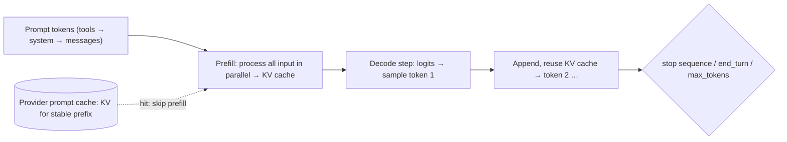

# LLM Fundamentals - Tokens, Context & Sampling

> [!info] Deep dive of [[LLM Fundamentals]]

> [!abstract] TL;DR
> Three mechanics drive almost every cost, latency and quality decision:
> - **Tokens**: the units models read, write and bill by. Model-specific tokenizers, and roughly 4 English characters per token.
> - **Context window**: everything the model can see in one request. It's stateless, so every turn re-sends history, and quality degrades as it fills ("context rot").
> - **Sampling**: how the next token is picked from a probability distribution. Temperature/top-p were the knobs, but on the newest reasoning models they're often fixed, and **effort** replaces them.
>
> Remember: **measure tokens per request, cache the stable prefix, and curate context. Don't just fill it.**

## Concept

### Tokens
- **Tokenization**: Byte-Pair Encoding (BPE) or similar learns frequent byte sequences. Common words are one token. Rare words, numbers, code symbols and non-Latin scripts split into several.
- Rough ratios (vary by tokenizer):

| Content | ≈ Tokens |
|---|---|
| English prose | 1 token ≈ 4 chars ≈ 0.75 words |
| Malay | Similar to or slightly worse than English |
| Chinese | ~1–1.5 tokens per character |
| JSON / code | Dense: braces, quotes, whitespace all cost |
| Numbers | Often split per 1–3 digits, which is one reason arithmetic is error-prone |

- **Tokenizers differ per model family and version.** Newer Claude models (Opus 4.7+ tokenizer) can use ~1–1.35× the tokens of older ones for the same text. Re-baseline costs after migrations, and count with the provider's API (`count_tokens`), not a different vendor's library.

### Context window
- The max tokens per request (input + output, with a separate output cap). 2026 frontier: **200k–1M input**, up to **128k output** on large Claude models.
- **Stateless**: chat "memory" is the client re-sending prior turns, so cost per turn grows with history unless you cache, compact or summarize.
- **Context rot / lost-in-the-middle**: recall of facts in the middle of very long contexts is weaker than at the start or end. More context costs more and can lower accuracy.

### Sampling
- The model outputs **logits** → softmax → probability distribution over the vocabulary. Decoding picks the next token.
- **Temperature**: scales logits (lower = sharper/more deterministic, higher = more diverse).
- **Top-p (nucleus)**: sample from the smallest set of tokens whose cumulative probability ≥ p. **Top-k**: from the k most likely tokens.
- **Greedy** (temp 0) is still not perfectly deterministic in hosted APIs (batching, floating-point non-associativity, MoE routing).
- **Reasoning models** spend hidden "thinking" tokens first. On current Claude models (Opus 5.5, Sonnet 5.5, Fable 5.1), custom sampling parameters are rejected and you tune **effort** (`low` … `max`) instead.

## How It Works



- **Prefill** is compute-bound and fast per token, and it drives **time-to-first-token (TTFT)**. **Decode** is memory-bandwidth-bound, one token at a time, and drives **output tokens/sec**. Output tokens cost 4–5× input on most price sheets.
- **KV cache**: keys/values of processed tokens are kept, so each new token attends to past ones without recomputing them. Its size grows linearly with context length, which is why long contexts are expensive to serve.
- **Prompt caching** (API feature): the provider stores the KV state for an exact **prefix**. Later requests with an identical prefix read it at a fraction of the price (Claude cache reads ≈ 2.5–10% of the input price) with much lower TTFT.
  - Cache writes cost slightly more, and entries expire (default ~5 min, with longer TTL options).
  - Any byte change in the prefix invalidates everything after it.
  - Prefixes below a minimum size (hundreds to a few thousand tokens, model-dependent) aren't cached.
- **Stop reasons** to handle: `end_turn`, `max_tokens` (truncated), `stop_sequence`, `tool_use`, `pause_turn`, `refusal`.

## Practical Usage

### Count before you send (Claude example, TypeScript SDK)
```ts
const { input_tokens } = await anthropic.messages.countTokens({
  model: "claude-opus-5-5",
  system: SYSTEM_PROMPT,
  messages,
  tools,
});
if (input_tokens > 600_000) messages = await compactHistory(messages);   // budget guard
```

### Cache-friendly request layout
```text
[tools — stable, sorted]                  ← cached
[system prompt — frozen text, no timestamps] ← cached (breakpoint here)
[long reference docs — stable per tenant]  ← cached (breakpoint)
[conversation history]                    ← grows; cache up to the last turn
[new user message + volatile data (date, IDs)] ← not cached
```
- Verify with usage fields (`cache_read_input_tokens` > 0 on repeat calls). If it's always zero, something in the prefix changes per request (timestamps, unsorted JSON, a varying tool list).

### Managing long conversations
| Technique | How | Trade-off |
|---|---|---|
| Sliding window | Keep the last N turns | Loses early facts |
| Summarization / compaction | Replace old turns with a summary (server-side compaction where available) | Summary can drop details |
| Clear old tool results | Remove bulky tool outputs after they're used | Model can't re-read them |
| External memory | Store facts in a DB/vector store, retrieve on demand ([[RAG]]) | Retrieval misses |
| Sub-agents | Delegate reading-heavy work to fresh contexts, return a summary | Extra calls |

### Picking decoding settings (models that still accept them)
| Task | Temperature / top-p | Notes |
|---|---|---|
| Extraction, classification, JSON | 0–0.2 | Plus structured outputs |
| Customer replies | 0.3–0.7 | Some variety, consistent tone |
| Brainstorming, copy variants | 0.8–1.0 | Generate N candidates, then rank |
| Reasoning models (new Claude) | n/a (rejected) | Use effort: `low` for chat/classify, `high`/`xhigh` for agents/coding |

## Patterns & Anti-patterns
| Pattern | When | Anti-pattern to avoid |
|---|---|---|
| Log tokens (in/out/cache) + cost per route | Always | Discovering costs from the invoice |
| Stable prefix + caching | Repeated system prompts/docs | `Today is {{now}}` at the top of the system prompt |
| Generous `max_tokens` + streaming | Long outputs | Tiny caps → truncated JSON, retries |
| Curated, relevant context | Q&A over docs | "Dump all 500 pages, the window is big enough" |
| Effort tuning per route | Reasoning models | One global max effort for everything |
| Re-baseline after model/tokenizer change | Migrations | Assuming the same token counts and prices |

## Performance & Trade-offs
- **Cost ≈ input × price_in + output × price_out (+ thinking tokens as output) − cache savings.** Long agent loops re-send growing history, so caching usually cuts 50–90% of input cost.
- **Latency ≈ TTFT (prefill, queueing) + output_tokens / tokens_per_sec.** Shorter outputs beat a faster model for most UX goals.
- Long contexts increase TTFT and price linearly and can reduce accuracy. Retrieval plus a smaller context is often both cheaper and better.
- Batch APIs (~50% cheaper, async) suit offline jobs: contextualizing chunks, bulk classification.

## Tips & Reminders
> [!tip]
> - Budget in tokens, not characters: support chat ~1–3k tokens/turn, RAG answer ~5–20k, agent task 50k–1M+.
> - Always check `stop_reason` before trusting output (truncation, refusal).
> - Keep numeric computation out of the model. Use code/tools for math and dates.
> - **In ZP's stack**: when quoting AI features in RM, estimate tokens/conversation × volume × price + 30–50% buffer, and cache client SOP/policy blocks as stable prefixes. Malay/Chinese chats can cost noticeably more tokens than English, so measure with real samples.

## Version Notes
| Change | When | Impact |
|---|---|---|
| 100k → 1M context windows | 2023 → 2025–26 | Long-context becomes standard. Context rot still applies |
| Prompt caching in major APIs | 2024 | Big cost/latency cuts for stable prefixes |
| Reasoning models + effort | 2024-09 → 2026 | Hidden thinking tokens billed as output. Sampling knobs replaced by effort on some models |
| New tokenizers (e.g. Claude Opus 4.7+) | 2026 | Same text → different token counts. Re-baseline |
| Server-side compaction / context editing | 2025–26 | Managed long conversations without client-side summarizers |

## Critical Issues & Gotchas
> [!danger] Silent truncation
> Hitting `max_tokens` cuts output mid-sentence or mid-JSON, and clients that don't check `stop_reason` store broken data or execute partial tool calls. Validate structured output and handle `max_tokens` explicitly.

> [!warning] Gotchas
> - Hidden thinking tokens count toward output cost and sometimes `max_tokens`.
> - Token counts from one vendor's tokenizer (e.g. `tiktoken`) are wrong for other vendors.
> - Cache invalidation is byte-exact: reordering JSON keys or tool definitions kills cache hits.
> - Context window ≠ attention quality. Critical instructions buried mid-context get ignored more often.
> - Non-determinism even at temperature 0, so evals need multiple runs for stable metrics.

## Related
- [[LLM Fundamentals]]
- [[Prompt Engineering]] — structuring context
- [[RAG]] — retrieval instead of stuffing context
- [[AI Agents]] — context management in loops
- [[LLM APIs & SDKs]] — caching, batching, token counting APIs

## References
- Anthropic token counting: https://docs.claude.com/en/docs/build-with-claude/token-counting
- Anthropic prompt caching: https://docs.claude.com/en/docs/build-with-claude/prompt-caching
- "Lost in the Middle" (Liu et al., 2023): https://arxiv.org/abs/2307.03172
- Neural text degeneration / nucleus sampling (Holtzman et al.): https://arxiv.org/abs/1904.09751
