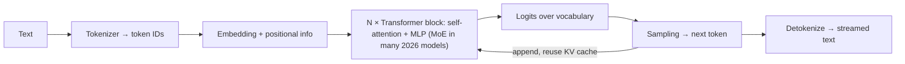

# LLM Fundamentals

> [!abstract] TL;DR
> An LLM is a transformer that predicts the next **token** given all previous tokens in its **context window**, trained on web-scale text and then post-trained (instruction tuning, RLHF/RL) into an assistant. Everything practical follows from that: cost and latency scale with tokens, the model only "knows" its training data + what you put in context, outputs are sampled (not looked up), and reasoning models spend extra tokens "thinking" before answering. Engineer around **tokens, context, caching, structured outputs, evaluation and injection risk**, not around "intelligence".

## Introduction
- **Lineage**: "Attention Is All You Need" (Google, 2017) → GPT-2/3 (2019–20) → ChatGPT (Nov 2022) → tool-using, multimodal, long-context **reasoning models** (2024–26).
- **Training stages**:
  1. **Pre-training**: next-token prediction on trillions of tokens.
  2. **Post-training**: SFT on demonstrations, then preference/RL training (RLHF, RLAIF, RL on verifiable tasks like code and math) for helpfulness, safety and reasoning.
- **Model types**:
  - Closed frontier APIs: Anthropic Claude, OpenAI GPT, Google Gemini.
  - Open-weight models: Llama, Qwen, DeepSeek, Mistral, gpt-oss. You can self-host them, and licenses vary.
- Where it sits: the reasoning/language engine inside [[RAG]] systems, [[AI Agents]], chatbots (WhatsApp), document extraction and code assistants, reached through [[LLM APIs & SDKs]].

## Core Concepts

### Tokens
- Text is split into sub-word tokens (BPE-style vocabularies, ~100k–260k entries). Rule of thumb: **~4 characters ≈ 1 token in English**. Malay is similar or slightly worse. Chinese is roughly 1–1.5 tokens per character. Code and JSON are token-dense.
- Billing, context limits, rate limits and latency are all **per token**. Different model families use different tokenizers, so the same prompt has different counts. Count with the provider's API (e.g. Anthropic `count_tokens`), not `tiktoken`, for non-OpenAI models.

### Context window
- The maximum tokens (input + output) per request: **200k–1M+** on 2026 frontier models. The output cap is separate (e.g. 64k–128k).
- **The model is stateless**: "memory" means re-sending history every turn. A long chat costs O(turns²) tokens without caching or compaction.
- **Context rot**: retrieval and reasoning quality degrade as context grows, especially for facts in the middle. More context ≠ better answers. Curate it.

### Sampling
- The model outputs a probability distribution over the vocabulary. Decoding picks a token, then repeats.
- **Temperature** (randomness), **top-p** (nucleus), **top-k**. Low temperature makes output more deterministic, but never fully: batching and floating point cause nondeterminism.
- Note: the newest Claude models (Opus 5.5, Fable 5.1, Sonnet 5.5…) **reject custom sampling params**, and reasoning effort is the tuning knob instead. Don't build logic that depends on `temperature=0` reproducibility.

### Reasoning ("thinking") models
- The model generates hidden or summarized reasoning tokens before the answer. Quality on math, code and multi-step tasks rises sharply, and so do cost and latency.
- Control is via **effort levels** (`low` … `max`) and adaptive thinking rather than fixed token budgets on current Claude models. Thinking tokens are billed as output.

### Tool use (function calling)
- You describe tools as JSON Schema. The model returns a structured `tool_use` call, **your code executes it**, and you return the result. That loop is the basis of [[AI Agents]] and [[Model Context Protocol|MCP]].
- `strict` schemas / structured outputs guarantee valid JSON arguments.

### Structured outputs
- Constrained decoding against a JSON Schema (`output_config.format` on Claude, `response_format` on OpenAI). Prefer it over "please reply in JSON" plus regex parsing.

### Embeddings
- A separate model maps text to vectors (e.g. 768–3072 dims). Cosine similarity ≈ semantic similarity. This underlies [[RAG]], dedupe, clustering and classification. Store them in pgvector / [[Vector Databases]].

### Knowledge & hallucination
- The model's knowledge is frozen at its **training cutoff**. It produces fluent text even when wrong (**hallucination**). Ground answers with retrieval/tools, require citations, and evaluate.

## Architecture / How It Works



- **Self-attention**: every token attends to every previous token. Compute grows ~quadratically with sequence length in naive form, and providers use optimized kernels plus sparse/linear variants.
- **Mixture-of-Experts (MoE)**: only a subset of parameters ("experts") is active per token, so you get large total capacity at lower inference cost. Common in DeepSeek, Qwen, gpt-oss and others.
- **Inference phases**:
  - **Prefill** processes the whole prompt in parallel. It's fast per token and drives **time-to-first-token (TTFT)**.
  - **Decode** generates one token at a time. It's memory-bandwidth bound and drives **tokens/sec**.
  - The **KV cache** stores attention keys/values so earlier tokens aren't recomputed.
- **Prompt caching** (API feature): the provider keeps the KV state for a stable **prefix** (tools → system → messages). Cache reads cost a fraction of normal input (≈2.5–10% on Claude) and cut TTFT. Any byte change in the prefix invalidates everything after it.
- **Batching**: providers batch many requests per GPU. Batch APIs (async, ~50% cheaper) suit non-interactive jobs.

## Project Structure
N/A — a concept, not a framework. A typical LLM feature layout:

```text
src/llm/
├── client.ts           # one wrapper: provider SDK, retries, timeouts, model + effort config
├── prompts/            # versioned system prompts (files, not inline strings)
├── schemas.ts          # zod/JSON schemas for structured outputs + tool inputs
├── tools/              # tool definitions + handlers (authz inside)
├── evals/              # golden datasets + graders; run in CI
└── telemetry.ts        # token usage, cost, latency, cache hit rate per route
```

## Use Cases
| Use case | Why it fits |
|---|---|
| Extraction (invoices, IC, receipts, emails → JSON) | Structured outputs + vision. High ROI for SMEs |
| Customer chat (WhatsApp, web) | Natural language + tools for order lookup, booking, FAQ via [[RAG]] |
| Classification / routing / triage | Cheap small models at low effort, high accuracy with few-shot |
| Summarization & drafting | Long context, tone control |
| Coding assistants & agents | Reasoning models + tools (files, shell, tests) |
| Translation (BM ⇄ EN ⇄ ZH) | Strong multilingual models. Review for legal text |

## Pros & Cons
| Pros | Cons |
|---|---|
| General-purpose: one API handles many tasks | Non-deterministic, hallucinates, needs evals and guardrails |
| Natural-language interface for non-technical users | Cost and latency scale with tokens. Reasoning models are slow |
| Rapid capability gains (months, not years) | Rapid churn: models deprecated, behaviour shifts between versions |
| Tool use turns text into actions | Prompt injection makes tool access a security problem |
| Long context reduces the need for complex retrieval | Data residency/privacy concerns with third-party APIs |

## Alternatives & Peers
Model landscape snapshot (Oct 2026). Prices are USD per 1M input/output tokens:

| Option | Strength | Weakness | Pick it when… |
|---|---|---|---|
| Claude (Fable 5.1 $10/$50 · Opus 5.5 $4/$20 · Sonnet 5.5 $2/$10 · Haiku 4.5 $1/$5) | Coding, agents, long-context reliability, 1M context (Haiku 200k), 128k output | Premium top tier. Some newer API constraints (no prefill, no forced tool choice on latest) | Agentic/coding workloads, careful document work |
| OpenAI GPT-6 family (Astra / Sol / Luna) | Broad ecosystem, very cheap small tier | Frequent model/API changes | Cost-sensitive high-volume routes, OpenAI-native tooling |
| Google Gemini 3.x / 4 | Multimodal (video/audio), huge context, Google Cloud integration | Behaviour/version churn | Media-heavy inputs, GCP shops |
| Open-weight (Qwen, DeepSeek V4, Llama, gpt-oss, Mistral) | Self-host, data control, no per-token fees, fine-tunable | GPU ops cost, lower top-end quality, license nuances | Data must stay on-prem, steady high volume |
| Classic ML / rules | Deterministic, cheap, explainable | Brittle on free text | Structured inputs, strict compliance logic |

> [!warning] Unverified — check before relying on this
> Non-Anthropic model names and prices come from third-party trackers (Sep 2026) and change monthly. Always check provider pricing pages before quoting a client.

## Tips & Reminders
> [!tip] Engineering defaults
> - **Measure first**: log input/output/cache tokens, latency and cost per route from day one.
> - **Cache the prefix**: freeze system prompts and tool lists, and put volatile data (timestamps, user IDs) last.
> - **Right-size**: try the strongest model at **lower effort** before building multi-model cascades. Use a small model for classification/extraction.
> - **Structured outputs > parsing prose**. Validate everything with a schema anyway.
> - **Evals before prompt tweaks**: a 30–100 example golden set catches regressions when models change.
> - Stream responses for UX. Set generous `max_tokens`, because truncated output costs a retry.

> [!tip] In ZP's stack
> - Pricing to SMEs: estimate tokens per conversation × volume × model price, then add a 30–50% buffer. Pass through or cap LLM costs explicitly in the quote (RM), because model prices and FX move.
> - [[n8n]] AI Agent nodes are fine for prototypes. Move high-volume or critical flows to code ([[LangChain & LangGraph]] or the provider SDK) with evals.
> - PDPA: customer chats sent to US-hosted APIs are cross-border transfers. Disclose them in the privacy notice, minimise PII, and check provider data retention and region options.

## Versions & Breaking Changes
| Milestone | Released | Key changes | Breaking / migration notes |
|---|---|---|---|
| Transformer paper | 2017-06 | Self-attention architecture | — |
| GPT-3 | 2020-05 | Few-shot in-context learning at 175B params | — |
| ChatGPT | 2022-11 | RLHF chat assistants go mainstream | — |
| Tool use / function calling | 2023 | Structured tool calls in APIs | Agents become practical |
| Reasoning models | 2024-09 → | Test-time compute ("thinking") | Latency/cost profiles change. Effort becomes a tuning knob |
| 1M context + agentic APIs | 2025–26 | 1M windows standard on frontier, compaction, MCP, computer use | Prefill removed, sampling params rejected, forced tool choice removed on newest Claude models. Re-test prompts on every migration |

## Critical Issues & Gotchas
> [!danger] Prompt injection (OWASP LLM01)
> Any untrusted text in context (emails, web pages, PDFs, WhatsApp messages, RAG chunks) can carry instructions the model may follow. Example: **EchoLeak (CVE-2025-32711, Jun 2025)**, a zero-click injection in Microsoft 365 Copilot that exfiltrated data via a crafted email. Mitigate with least-privilege tools, server-side authorization, human approval for side effects, output filtering and no secrets in prompts.

> [!danger] Silent model changes & deprecations
> Providers retire models on schedules (often 6–12 months' notice) and update aliases. Behaviour, tokenizers and API parameters change between versions (e.g. tokenizer changes alter token counts by up to ~35%). Pin model IDs, keep evals, and budget migration time into retainers.

> [!warning] Footguns
> - Hallucinated citations, IDs and numbers. Verify against sources/tools before acting.
> - Long chats without compaction → exploding costs and degraded answers.
> - Assuming `temperature=0` = deterministic.
> - Logging full prompts with PII to third-party observability tools.
> - Treating model output as trusted code/SQL/HTML (XSS, injection). Always escape and validate.
> - Hidden thinking tokens count toward cost and `max_tokens`. Budget for them.

## Deep Dives
- (planned) [[LLM Fundamentals - Tokens, Context & Sampling]]

## Related
- [[Prompt Engineering]] — steering behaviour within these mechanics
- [[RAG]] — grounding with retrieved context
- [[AI Agents]] · [[Model Context Protocol]] — tool-use loops
- [[LLM APIs & SDKs]] — provider APIs, caching, batching
- [[Fine-tuning LLMs]] — when prompting/RAG isn't enough
- [[AI Evals & Observability]] — measuring quality and cost
- [[LangChain & LangGraph]] — orchestration framework

## References
- Attention Is All You Need: https://arxiv.org/abs/1706.03762
- Anthropic models overview: https://docs.claude.com/en/docs/about-claude/models/overview
- Anthropic prompt caching: https://docs.claude.com/en/docs/build-with-claude/prompt-caching
- OWASP Top 10 for LLM Applications: https://genai.owasp.org/llm-top-10/
- Model release timeline (2026): https://llmgateway.io/timeline/2026
- API pricing comparison (Sep 2026): https://www.developersdigest.tech/blog/frontier-model-api-pricing-june-2026
