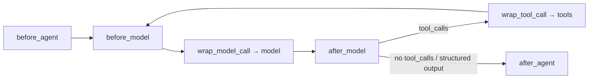

# LangChain & LangGraph - Agents, Tools & Middleware

> [!info] Deep dive of [[LangChain & LangGraph]]

> [!abstract] TL;DR
> `create_agent` is LangChain 1.x's single agent constructor. It builds a LangGraph `model ⇄ tools` loop that runs until the model stops calling tools or structured output is produced. You customize it with **middleware**: hooks around the agent, each model call and each tool call. Tools are typed functions whose docstring is the prompt. Remember: **customize through middleware, not by forking the loop**. Drop to a raw graph only when the topology itself changes.

## Concept
- **Agent loop**: `model` node → if `AIMessage.tool_calls` is non-empty → `tools` node executes them (in parallel) → `ToolMessage`s go back to `model` → repeat. It ends when there are no tool calls, a structured response is produced, or a middleware jumps to `end`.
- **`create_agent` parameters**:

| Param | Purpose |
|---|---|
| `model` | `"provider:model"` string or a `BaseChatModel` instance |
| `tools` | `@tool` functions, `BaseTool`s, dicts (provider built-in tools), MCP tools |
| `system_prompt` | String or `SystemMessage`. Dynamic prompts go through middleware |
| `middleware` | Ordered list of `AgentMiddleware` |
| `response_format` | Pydantic/TypedDict/JSON schema, or `ToolStrategy(...)` / `ProviderStrategy(...)` |
| `state_schema` / `context_schema` | Extend `AgentState` / typed run-scoped context |
| `checkpointer` / `store` | Short-term (thread) / long-term memory |
| `name` | Required when the agent is used as a subgraph in multi-agent setups |

- The result is a compiled LangGraph graph: `invoke`, `stream`, `get_state`, interrupts all work.

## How It Works



- **Node-style hooks** (`before_agent`, `before_model`, `after_model`, `after_agent`) run as graph nodes. They return a state update dict, or `None`.
- **Wrap-style hooks** (`wrap_model_call`, `wrap_tool_call`) receive `(request, handler)`. They can modify the request, call `handler` zero, one or many times (retry, fallback), or short-circuit with a fake response.
- **Ordering** with `middleware=[A, B, C]`:
  - `before_*` run A → B → C.
  - `after_*` run C → B → A.
  - `wrap_*` nest with A outermost: `A(B(C(model)))`.
- **Jumps**: a node-style hook can return `{"jump_to": "end" | "tools" | "model"}`. The hook must declare it with `@hook_config(can_jump_to=[...])`.
- Middleware can add **state keys** (`state_schema`) and **tools** (`tools = [...]` on the class). This is how `TodoListMiddleware` adds `write_todos` + a `todos` key.

## Practical Usage

### Tools
```python
from typing import Literal
from pydantic import BaseModel, Field
from langchain.tools import tool, ToolRuntime
from langchain.messages import ToolMessage
from langgraph.types import Command

class SearchArgs(BaseModel):
    query: str = Field(description="Full-text query, Malay or English")
    status: Literal["open", "paid", "void"] | None = None

@tool(args_schema=SearchArgs)
def search_invoices(query: str, status: str | None, runtime: ToolRuntime) -> list[dict]:
    """Search the current tenant's invoices. Use before answering any billing question."""
    tenant = runtime.context.tenant_id          # injected, never visible to the model
    return repo.search(tenant, query, status)[:20]

@tool
def set_language(lang: str, runtime: ToolRuntime) -> Command:
    """Switch reply language when the user asks."""
    return Command(update={"lang": lang, "messages": [
        ToolMessage(f"Language set to {lang}", tool_call_id=runtime.tool_call_id)]})
```
- A `ToolRuntime` parameter is **hidden from the schema**. It exposes `state`, `context`, `store`, `stream_writer`, `config` and `tool_call_id`.
- Returning a `Command` lets a tool update graph state. It must include a `ToolMessage` for its `tool_call_id`, or the provider rejects the next call.
- Raise errors with useful text. By default the tool node turns them into a `ToolMessage` so the model can self-correct.

### Middleware: decorators for one-offs
```python
from langchain.agents import create_agent
from langchain.agents.middleware import before_model, wrap_model_call, dynamic_prompt, hook_config

@dynamic_prompt
def prompt_by_plan(request) -> str:
    plan = request.runtime.context.plan
    return BASE_PROMPT + ("\nYou may issue refunds." if plan == "pro" else "")

@wrap_model_call
def cheap_first(request, handler):
    if len(request.state["messages"]) < 6:
        request = request.override(model=small_model)    # dynamic model selection
    return handler(request)

@before_model
@hook_config(can_jump_to=["end"])
def block_abuse(state, runtime):
    if is_abusive(state["messages"][-1].content):
        return {"messages": [AIMessage("I can't help with that.")], "jump_to": "end"}

agent = create_agent("openai:gpt-5", tools=[search_invoices], context_schema=Ctx,
                     middleware=[block_abuse, prompt_by_plan, cheap_first])
```

### Middleware: class for reusable/stateful logic
```python
from langchain.agents.middleware import AgentMiddleware, AgentState

class AuditMiddleware(AgentMiddleware):
    def wrap_tool_call(self, request, handler):
        started = time.perf_counter()
        result = handler(request)
        audit_log(request.tool_call["name"], request.tool_call["args"], time.perf_counter() - started)
        return result
```

### Built-in middleware worth knowing
| Middleware | Does |
|---|---|
| `SummarizationMiddleware` | Summarizes old messages past a token/message trigger and keeps the last N |
| `HumanInTheLoopMiddleware` | `interrupt()` before chosen tools. Decisions: approve / edit / reject |
| `ModelCallLimitMiddleware` / `ToolCallLimitMiddleware` | Hard caps per thread/run, a cost guard |
| `ModelFallbackMiddleware` | Retries on alternate models on error |
| `ToolRetryMiddleware` / `ModelRetryMiddleware` | Exponential backoff on transient failures |
| `PIIMiddleware` | Redact/mask/block emails, cards, custom regex in inputs/outputs |
| `TodoListMiddleware` | Adds a planning tool + `todos` state for long tasks |
| `LLMToolSelectorMiddleware` | A cheap model pre-selects relevant tools when you have many |
| `ContextEditingMiddleware` | Clears old tool outputs when the context grows |
| `AnthropicPromptCachingMiddleware` (`langchain-anthropic`) | Adds cache-control breakpoints |

### Structured output
```python
from langchain.agents.structured_output import ToolStrategy

agent = create_agent(model, tools, response_format=ToolStrategy(Ticket))
result = agent.invoke({"messages": [...]})
ticket: Ticket = result["structured_response"]
```
- `ProviderStrategy` uses native JSON-schema mode and is the most reliable where it's supported. `ToolStrategy` works with any tool-calling model and retries on validation errors (`handle_errors=True`).
- Passing a bare schema lets LangChain pick the strategy from the **model profile** (1.1+).

### MCP tools
```python
from langchain_mcp_adapters.client import MultiServerMCPClient

client = MultiServerMCPClient({"crm": {"transport": "streamable_http", "url": "https://mcp.internal/crm"}})
tools = await client.get_tools()
agent = create_agent("anthropic:claude-sonnet-4-5", tools=tools)
```

## Patterns & Anti-patterns
| Pattern | When | Anti-pattern to avoid |
|---|---|---|
| Few sharp tools with precise docstrings | Always | 30 overlapping tools ("get_user", "fetch_user", "user_lookup") |
| Tenant/auth via `ToolRuntime.context` | Multi-tenant SaaS | Letting the model pass `tenant_id` as a tool arg (IDOR via prompt injection) |
| HITL middleware on side-effecting tools | Refunds, deletes, outbound messages | Asking the model to "confirm with the user first" in the prompt |
| Call-limit middleware | Every prod agent | Unbounded loops paying for 200 calls |
| Summarization/context-editing middleware | Long threads | Stuffing the whole history until a context-length error |
| Dynamic model in `wrap_model_call` | Cost tiering | Two separate agents with copy-pasted config |
| Return compact JSON / top-N from tools | Data-heavy tools | Returning 5 MB API responses into the context |

## Performance & Trade-offs
- **Latency ≈ model calls × model latency**. Parallel tool calls run concurrently in the tools node, so prefer models/prompts that batch calls.
- **Token cost** is dominated by re-sending history + tool schemas every turn. Tool selection, context editing and prompt caching cut it most.
- **`ToolStrategy`** adds an extra tool round-trip and can retry, while `ProviderStrategy` costs nothing extra.
- Each middleware node-hook adds a graph step, which counts toward `recursion_limit` and adds checkpoint writes.

## Tips & Reminders
> [!tip]
> - Treat tool docstrings as prompt. Say *when* to use the tool, not only what it does.
> - Return tool errors as instructions ("order_id must look like A123; ask the user"). Models recover well from good error text.
> - Validate permissions **inside** the tool against `runtime.context`. Never trust model-supplied identifiers.
> - **In ZP's stack**: for WhatsApp agents, put `wa_id`/`tenant_id` in `context`, guard outbound-send tools with HITL or a call limit, and add `PIIMiddleware` before LangSmith tracing (PDPA).

> [!question] Self-check
> - In `[A, B]`, which `after_model` runs first? (B.) Which `wrap_model_call` is outermost? (A.)
> - Why must a tool that returns `Command` include a `ToolMessage`?
> - `ToolStrategy` vs `ProviderStrategy`: which works on every tool-calling model?

## Version Notes
| Version | Change |
|---|---|
| ≤ 0.3 | `AgentExecutor`, `initialize_agent`, `create_react_agent` (LangGraph prebuilt). Hooks via `pre_model_hook`/`post_model_hook` |
| 1.0 (2025-10-22) | `create_agent` + middleware. `AgentExecutor` → `langchain-classic`. `create_react_agent` deprecated. Python ≥ 3.10 |
| 1.1 (2025-Q4) | Model profiles. `ProviderStrategy` inferred. Summarization middleware triggers by fraction of context window |
| 1.2–1.4 (2026) | Additional built-in middleware and fixes |

> [!warning] Unverified — check before relying on this
> Exact middleware additions per 1.2–1.4 minor weren't verified. Check `langchain.agents.middleware` in the installed version.

## Critical Issues & Gotchas
> [!danger] Prompt injection → tool abuse
> Any text the agent reads (emails, web pages, RAG chunks, WhatsApp messages) can instruct it to call tools. Mitigate with least-privilege tools, server-side authz from `context`, HITL on side effects, and output allow-lists. Never give an agent a generic `run_sql`/`shell` tool against prod.

> [!danger] Missing `ToolMessage` for a tool call
> If a middleware or `Command` drops the `ToolMessage` for a `tool_call_id`, the next model call fails with a provider 400 ("tool_use ids without tool_result"). This often surfaces only after a resume from an interrupt.

> [!warning] Hook order surprises
> `after_*` runs in reverse. A PII redaction in `after_model` placed first in the list runs **last**, after an audit middleware has already logged raw output.

> [!warning] Old tutorials
> `from langchain.agents import AgentExecutor` fails on 1.x without `langchain-classic`, and LLM copilots still generate it.

## Related
- [[LangChain & LangGraph]]
- [[LangChain & LangGraph - Graph API, State & Control Flow]]
- [[LangChain & LangGraph - Persistence, Memory & Human-in-the-Loop]] — HITL middleware internals
- [[AI Agents]] · [[Model Context Protocol]] · [[Prompt Engineering]]

## References
- Agents: https://docs.langchain.com/oss/python/langchain/agents
- Middleware: https://docs.langchain.com/oss/python/langchain/middleware
- Tools: https://docs.langchain.com/oss/python/langchain/tools
- Structured output: https://docs.langchain.com/oss/python/langchain/structured-output
- What's new in v1: https://docs.langchain.com/oss/python/releases/langchain-v1
- LangChain 1.1: https://changelog.langchain.com/announcements/langchain-1-1
