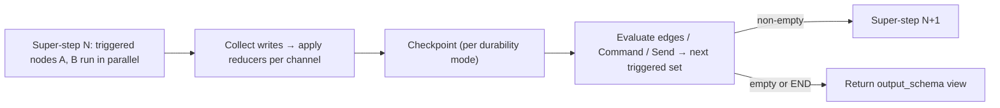

# LangChain & LangGraph - Graph API, State & Control Flow

> [!info] Deep dive of [[LangChain & LangGraph]]

> [!abstract] TL;DR
> A `StateGraph` is a typed state schema, a set of nodes that return **partial updates**, and edges that decide what runs next. Updates merge through per-key **reducers**. Execution happens in **super-steps**: all triggered nodes run in parallel, then their writes are applied atomically. Route statically with edges, dynamically with conditional edges or `Command`, and fan out with `Send`. The one thing to remember: **a node never mutates state, it returns a diff, and the reducer decides how that diff lands.**

## Concept
- **State** is the only thing passed between nodes. It's defined as a `TypedDict` (most common), a `dataclass` (defaults) or a Pydantic `BaseModel` (runtime validation, slower).
- Each state key is a **channel**. A channel without a reducer is *last-write-wins*. A channel with `Annotated[T, reducer]` merges with `reducer(old, new)`.
- **Nodes** are sync or async callables. Allowed signatures: `(state)`, `(state, config)`, `(state, runtime)`. `Runtime[Ctx]` carries `context`, `store` and `stream_writer`.
- **Edges** decide which nodes trigger in the next super-step. A graph must be `.compile()`d before running. Compiling validates the topology and attaches the checkpointer, store and interrupts.
- **Input/output schemas** let the public API differ from internal state: `StateGraph(State, input_schema=In, output_schema=Out)`. Private channels (keys only some nodes declare) stay internal.
- **`context_schema`** (v1, replaces `config_schema`) holds immutable run-scoped dependencies such as `user_id`, DB clients or model names, passed as `graph.invoke(input, context={...})`.

## How It Works



1. `invoke(input)` writes the input into the channels and triggers the nodes connected to `START`.
2. In each super-step, every triggered node gets a **read snapshot** of the state, so parallel nodes don't see each other's writes inside the same step.
3. Writes are buffered. At the end of the step each channel applies its reducer to all writes it received. Two writes to a non-reducer key → `InvalidUpdateError`.
4. Edges, conditional-edge functions, `Command.goto` and `Send` objects produce the next triggered set.
5. The loop stops when nothing is triggered, or raises `GraphRecursionError` when the super-step count exceeds `recursion_limit` (default 25).
- This is the Pregel / Bulk Synchronous Parallel model. It's why fan-out is safe and fan-in is deterministic.

## Practical Usage

### State + reducers
```python
import operator
from typing import Annotated, TypedDict
from langchain_core.messages import AnyMessage
from langgraph.graph.message import add_messages

class State(TypedDict):
    messages: Annotated[list[AnyMessage], add_messages]   # append; dedupe/replace by message id
    findings: Annotated[list[str], operator.add]          # parallel-safe concat
    route: str                                            # last-write-wins
    attempts: int
```
- `add_messages` appends, **replaces messages with the same `id`**, accepts dicts/tuples and handles `RemoveMessage(id=...)` deletions. Use it rather than `operator.add` for chat history.
- `MessagesState` is a prebuilt `TypedDict` with just `messages: Annotated[list, add_messages]`. Subclass it to add keys.

### Conditional routing
```python
from typing import Literal

def route_after_grade(state: State) -> Literal["rewrite", "answer"]:
    return "rewrite" if state["route"] == "irrelevant" and state["attempts"] < 3 else "answer"

builder.add_conditional_edges("grade", route_after_grade)            # targets inferred from Literal
builder.add_conditional_edges("grade", route_after_grade, {"rewrite": "rewrite_q", "answer": "gen"})  # path_map
```
- Annotate the router's return type with `Literal[...]` or pass a `path_map`. Otherwise the graph can't render the edges and `draw_mermaid()` shows a disconnected node.

### `Command`: update + route from inside the node
```python
from langgraph.types import Command

def triage(state: State) -> Command[Literal["billing", "support"]]:
    dest = "billing" if "invoice" in state["messages"][-1].content else "support"
    return Command(update={"route": dest}, goto=dest)
```
- Use `Command` when routing and the state update are **one decision**. Use conditional edges when routing is a pure function of the state already written.
- `Command(graph=Command.PARENT, goto="other_agent")` jumps out of a subgraph into the parent. This is the multi-agent handoff primitive.
- The `Command[Literal[...]]` annotation is required for rendering and validation.

### `Send`: dynamic fan-out (map-reduce)
```python
from langgraph.types import Send

def fan_out(state: State):
    return [Send("summarize_doc", {"doc": d}) for d in state["docs"]]   # per-branch private input

builder.add_conditional_edges("load", fan_out, ["summarize_doc"])
builder.add_edge("summarize_doc", "reduce")   # reduce runs once after all branches (same super-step)
```
- The number of branches is decided at runtime. Each `Send` carries its own input, which can differ from the graph state.
- The fan-in key must have a reducer (`operator.add`). Otherwise parallel writes collide.

### Waiting for uneven branches
```python
builder.add_node("merge", merge, defer=True)   # runs only after all pending branches finish
```
- Without `defer=True`, a node fed by branches of different lengths (A→merge, B→C→merge) runs **twice**, once per super-step that reaches it.

### Retries, caching, step budget
```python
from langgraph.types import RetryPolicy, CachePolicy
from langgraph.cache.memory import InMemoryCache
from langgraph.managed import RemainingSteps

builder.add_node("call_api", call_api, retry_policy=RetryPolicy(max_attempts=3, initial_interval=1.0))
builder.add_node("embed", embed, cache_policy=CachePolicy(ttl=3600))
graph = builder.compile(cache=InMemoryCache())

class LoopState(State):
    remaining_steps: RemainingSteps      # managed value: read it to exit gracefully before the limit
```

### Subgraphs
| Mode | How | Use when |
|---|---|---|
| Added as node | `builder.add_node("research", research_graph)` | Parent and child **share** state keys |
| Invoked in a node | `def n(s): out = child.invoke(map_in(s)); return map_out(out)` | Schemas differ. You transform in and out |

- Subgraphs inherit the parent's checkpointer. Pass `checkpointer=True` when compiling the child if it needs its **own** persistent per-thread memory (e.g. a sub-agent that remembers).

## Patterns & Anti-patterns
| Pattern | When | Anti-pattern to avoid |
|---|---|---|
| Deterministic router node + `Command` | Classify-then-dispatch flows | LLM picking every edge, which is slow and non-reproducible |
| `Send` map-reduce with `operator.add` fan-in | N documents/queries known at runtime | Python `for` loop inside one node (no parallelism, no per-item retry) |
| Small, typed state with explicit keys | Always | Dumping raw API payloads into state, which bloats every checkpoint |
| `context_schema` for clients/IDs | Run-scoped deps | Putting DB connections in state (not serializable → checkpoint failure) |
| Loop counter + guard edge | Self-correcting loops (grade → rewrite) | Relying on `recursion_limit` as business logic |
| `defer=True` on fan-in of uneven branches | Asymmetric parallel paths | Ad-hoc "has everything arrived?" flags |
| Subgraph per agent/team | Multi-agent, reusable units | One 40-node flat graph |

## Performance & Trade-offs
- **Checkpoint cost scales with state size × steps**. Every super-step serializes changed channels. Keep large blobs (documents, embeddings) in the Store or object storage and put **references** in state.
- **Parallelism is per super-step**. A slow branch holds back the next step for every branch. Isolate slow I/O into its own subgraph or use `Send`.
- **Pydantic state** validates on every node output, which adds measurable overhead on hot loops. `TypedDict` does no runtime checks.
- **`recursion_limit`** counts super-steps, not LLM calls. A ReAct loop uses ~2 steps per tool round-trip, so the default 25 ≈ 12 tool calls.
- **Async**: use `ainvoke`/`astream` with async nodes. Sync nodes in an async graph run in a thread pool, which is fine for I/O but not for CPU-heavy work.

## Tips & Reminders
> [!tip]
> - Render early: `print(graph.get_graph().draw_mermaid())`. If the diagram looks wrong, the graph is wrong.
> - `graph.get_graph(xray=True)` expands subgraphs.
> - `stream_mode="updates"` is the best debugging view: it shows which node wrote what, step by step.
> - Return only the keys you change. Returning the full state re-applies reducers, which duplicates appended lists.
> - **In ZP's stack**: model an n8n-style "IF → branch → merge" as conditional edges + `defer=True` fan-in. It maps 1:1 to the mental model of [[n8n]] workflows.

> [!question] Self-check
> - Two parallel nodes both return `{"route": "x"}`. What happens? (`InvalidUpdateError` — no reducer.)
> - When would you choose `Command` over `add_conditional_edges`?
> - Why does returning the full `messages` list from a node not duplicate history with `add_messages`, but does with `operator.add`?

## Version Notes
| Version | Change |
|---|---|
| 0.2 (2024-08) | Checkpointers split out. Node signature with `config` |
| 0.3 (2025-02) | `Command` and `interrupt()` become the primary control primitives |
| 0.4–0.6 (2025) | `defer`, node caching, `context_schema` + `Runtime` introduced. `config_schema` deprecated |
| 1.0 (2025-10-22) | API frozen for stability. `create_react_agent` deprecated in favour of LangChain `create_agent` |
| 1.2.x (2026) | Current line. No breaking changes to the Graph API |

> [!warning] Unverified — check before relying on this
> The minor version that introduced `defer`, `CachePolicy` and `context_schema` (0.4 vs 0.5 vs 0.6) wasn't verified this run.

## Critical Issues & Gotchas
> [!danger] Mutating state in place
> `state["messages"].append(x); return state` mutates the snapshot that sibling nodes and the checkpointer still reference, which causes heisenbugs in parallel steps. Always return a new partial dict.

> [!danger] Non-serializable values in state
> Clients, generators, open files and lambdas in state crash the checkpointer at the end of the step, often only in prod (where a checkpointer exists) and not in tests. Put them in `context`.

> [!warning] Silent routing to a missing node
> A router that returns a string not in its `Literal`/`path_map` raises at runtime, not compile time. Unit-test routers as pure functions.

> [!warning] `GraphRecursionError` is a symptom
> Raising `recursion_limit` to 100 usually hides a loop where the model keeps calling a failing tool. Add a counter key and an exit edge, or use `RemainingSteps`.

## Related
- [[LangChain & LangGraph]]
- [[LangChain & LangGraph - Agents, Tools & Middleware]] — `create_agent` compiles to this graph model
- [[LangChain & LangGraph - Persistence, Memory & Human-in-the-Loop]] — what happens at each checkpoint
- [[LangChain & LangGraph - Multi-Agent Systems & LangSmith]] — subgraphs and `Command.PARENT` handoffs
- [[AI Agents]]

## References
- Graph API overview: https://docs.langchain.com/oss/python/langgraph/graph-api
- Use the Graph API (how-to): https://docs.langchain.com/oss/python/langgraph/use-graph-api
- LangGraph v1 migration: https://docs.langchain.com/oss/python/migrate/langgraph-v1
- Releases: https://github.com/langchain-ai/langgraph/releases
