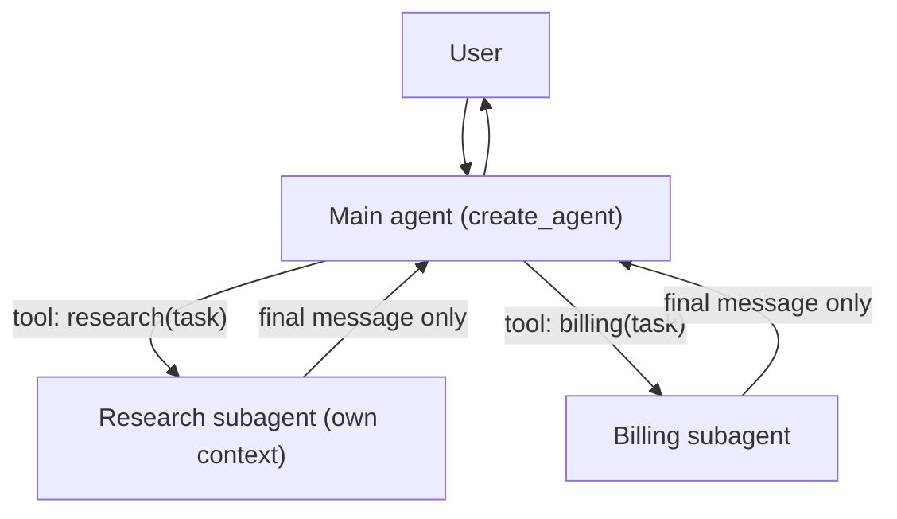

# LangChain & LangGraph - Multi-Agent Systems & LangSmith

> [!info] Deep dive of [[LangChain & LangGraph]]

> [!abstract] TL;DR
> Multi-agent in LangChain 1.x means a few patterns: **subagents** (a main agent calls specialists as tools), **handoffs** (state says which agent owns the turn), **router** (classify, then dispatch, possibly in parallel), and custom LangGraph workflows. `langgraph-supervisor` is superseded by the subagents pattern on `create_agent`. **LangSmith** is the tracing + eval + deployment platform around it. Remember: **multi-agent is a context-engineering tool, not a default.** Start with one agent and split only when tools or context overload it.

## Concept
| Pattern | Who decides next | Context each agent sees | Good for |
|---|---|---|---|
| **Subagents** (tool-calling supervisor) | Main agent, every turn | Subagent gets only the task string the main agent writes | Delegating isolated tasks, parallel work, keeping main context small |
| **Handoffs** | The active agent transfers control (`active_agent` in state) | Shared conversation | Customer-facing flows where the "persona" changes (sales → support) |
| **Router** | A classifier step (LLM or rules), once | Each specialist gets the routed query | Multi-source knowledge bases, intent dispatch |
| **Skills** | One agent loads specialized prompts/tools on demand | Single agent, progressively disclosed | Many capabilities, one conversation |
| **Custom workflow** | Your graph edges | Whatever you wire | Deterministic pipelines with agent steps inside |

- **Why split at all**: too many tools degrade tool selection, too much context degrades reasoning, separate teams own separate capabilities, and you need parallelism.
- **Cost of splitting**: extra LLM calls (supervisor "translation" overhead), lost context between agents, harder debugging. LangChain's own multi-agent benchmark found the tool-calling supervisor pays a measurable token and latency tax compared with direct handoffs.
- **Deep Agents** (`deepagents` package): an opinionated harness on `create_agent` with a planning tool (`write_todos`), a virtual file system (`ls`, `read_file`, `write_file`, `edit_file`), a `task` tool that spawns context-isolated subagents, and long-term memory. It targets long-horizon research/coding tasks.

## How It Works



- **Subagents**: each subagent is wrapped as a `@tool`. The main agent's tool call carries a task description, the subagent runs to completion in a **fresh context**, and only its final answer returns as a `ToolMessage`. Parallel tool calls give parallel subagents.
- **Handoffs**: handoff tools return `Command(goto="agent_b", graph=Command.PARENT, update={"active_agent": "agent_b", "messages": [...]})`. A parent graph routes on `active_agent`, so the next user message goes straight to the current owner.
- **Router**: a node classifies, then `Send`s to one or many specialists in parallel. A synthesizer merges their outputs through a reducer.

## Practical Usage

### Subagents (replaces `create_supervisor`)
```python
from langchain.agents import create_agent
from langchain.tools import tool

research_agent = create_agent("openai:gpt-5-mini", tools=[web_search, fetch_page],
                              system_prompt="Research the task. Reply with a cited summary only.")

@tool
def research(task: str) -> str:
    """Delegate open-ended research. Give a self-contained task with all needed context."""
    out = research_agent.invoke({"messages": [{"role": "user", "content": task}]})
    return out["messages"][-1].content

main = create_agent("anthropic:claude-sonnet-4-5", tools=[research, create_quote],
                    system_prompt="You coordinate. Delegate research; never research yourself.")
```
- The subagent's tool docstring is the **routing prompt**. Say what to pass, because the subagent sees nothing else.
- Return a compact final answer. Returning the whole subagent transcript defeats context isolation.

### Handoffs
```python
from langgraph.types import Command
from langchain.tools import tool, ToolRuntime
from langchain.messages import ToolMessage

@tool
def transfer_to_support(reason: str, runtime: ToolRuntime) -> Command:
    """Hand the conversation to the support agent for order/technical issues."""
    return Command(
        goto="support", graph=Command.PARENT,
        update={"active_agent": "support",
                "messages": [ToolMessage(f"Transferred: {reason}", tool_call_id=runtime.tool_call_id)]})
```
- Parent graph: nodes `sales` and `support` (each a `create_agent(name=...)`), plus a `START` conditional edge on `state["active_agent"]`.

### LangSmith tracing (zero-code)
```bash
export LANGSMITH_TRACING=true
export LANGSMITH_API_KEY=lsv2_...
export LANGSMITH_PROJECT=wa-agent-prod
export LANGSMITH_ENDPOINT=https://eu.api.smith.langchain.com   # EU region if needed
```
- Every LangChain/LangGraph run is traced automatically. Non-LangChain code uses `@traceable`.
- Add `metadata={"tenant": ..., "thread_id": ...}` and `tags=[...]` in `config` to filter traces.

### Offline evals
```python
from langsmith import Client
from openevals.llm import create_llm_as_judge
from openevals.prompts import CORRECTNESS_PROMPT

client = Client()
judge = create_llm_as_judge(prompt=CORRECTNESS_PROMPT, model="openai:gpt-5-mini", feedback_key="correctness")

def target(inputs: dict) -> dict:
    out = main.invoke({"messages": [{"role": "user", "content": inputs["question"]}]})
    return {"answer": out["messages"][-1].content}

def correctness(inputs, outputs, reference_outputs):
    return judge(inputs=inputs, outputs=outputs, reference_outputs=reference_outputs)

client.evaluate(target, data="support-golden-v1", evaluators=[correctness], experiment_prefix="sonnet-4.5")
```
- **Trajectory evals** (`agentevals`) check the sequence of tool calls, which is useful for routing regressions in multi-agent graphs.
- **Online evaluators** run on sampled prod traces. **Annotation queues** route traces to humans for labeling into datasets.

### LangSmith platform map
| Feature | Use |
|---|---|
| Tracing / Observability | Per-run tree of LLM, tool and node spans, with token and cost stats |
| Datasets & Experiments | Golden sets, offline comparison across prompts/models |
| Online evaluation & alerts | Score production traffic, alert on drift/errors |
| Prompt Hub / Playground | Versioned prompts, pull by tag at runtime |
| Studio | Visual graph debugger, step-through, edit state, resume interrupts |
| Deployment (formerly LangGraph Platform) | Managed Agent Server: threads, cron, task queue, double-texting handling |

## Patterns & Anti-patterns
| Pattern | When | Anti-pattern to avoid |
|---|---|---|
| Single agent + good tools first | Default | Five agents for a problem that needs eight tools |
| Subagents for context isolation | Research, document-heavy subtasks | Passing full parent history into every subagent |
| Handoffs for persona/ownership change | Multi-department chat | Supervisor re-reading and re-phrasing every user message |
| Router + parallel `Send` | Querying multiple KBs | Sequential tool calls when sources are independent |
| Golden dataset per agent before refactors | Any prompt/model change | "Looks good in Studio" as the release gate |
| Trace metadata: tenant, channel, version | Multi-tenant SaaS | Unfilterable traces across clients |

## Performance & Trade-offs
- Each delegation is at least one extra model call. A supervisor with 2 subagents per turn costs roughly 3–5× a single agent.
- Parallel subagents cut wall-clock time but not tokens.
- Handoffs are the cheapest multi-agent pattern (no translation layer) but have the weakest isolation, since all agents share history.
- LangSmith tracing is asynchronous, with a background batch upload and negligible latency. But it **sends full inputs/outputs to a third party**.
- LangSmith retention: base traces ~14 days, extended ~400 days (extended costs more). Pricing is per seat + per trace.

> [!warning] Unverified — check before relying on this
> LangSmith plan prices and retention tiers change often. Check https://www.langchain.com/pricing before quoting costs to a client.

## Tips & Reminders
> [!tip]
> - Give every `create_agent` used as a subgraph a `name`. It appears in traces and is required for some handoff utilities.
> - Version prompts and log the version in trace metadata. Otherwise evals can't explain regressions.
> - Self-hosting alternative: Langfuse or Arize Phoenix via OpenTelemetry. LangSmith also ingests OTel.
> - **In ZP's stack**: for client deployments, default to self-hosted tracing (Langfuse on [[Coolify]]) or the LangSmith EU region + `PIIMiddleware`. Put the tracing vendor in the client's DPA/PDPA data-processor list.

> [!question] Self-check
> - Subagents vs handoffs: which keeps the main context small, and which lets the specialist talk to the user directly?
> - What does `graph=Command.PARENT` do?
> - Name three LangSmith features beyond tracing.

## Version Notes
| Version | Change |
|---|---|
| 2024 | `langgraph-supervisor`, `langgraph-swarm` helper packages |
| 2025-07 | `deepagents` package released |
| 1.0 (2025-10) | `create_agent` becomes the base for all patterns. LangGraph Platform rebranded to LangSmith Deployment |
| 2025–26 | Docs recommend migrating `create_supervisor` → subagents on `create_agent` (official migration guide) |

## Critical Issues & Gotchas
> [!danger] Cross-agent prompt injection
> Output from a web-browsing subagent becomes input to a privileged main agent. Treat subagent results as untrusted. Don't give the main agent destructive tools that the subagent's text could trigger, or gate them with HITL.

> [!danger] PII leakage to tracing SaaS
> Traces store full prompts, tool args and outputs: phone numbers, IC numbers, addresses. That's a cross-border transfer under PDPA (Malaysia, 2024 amendments). Redact before tracing (`PIIMiddleware`, `hide_inputs`/`hide_outputs` on the client) or self-host.

> [!warning] Infinite ping-pong
> Two agents with handoff tools to each other can loop until `GraphRecursionError`. Add handoff counters or a call-limit middleware.

> [!warning] Vendor gravity
> Studio, Deployment and online evals tie you to LangSmith. Self-hosted LangSmith is enterprise-only. Keep evals in `openevals`/plain pytest so they survive a vendor switch.

## Related
- [[LangChain & LangGraph]]
- [[LangChain & LangGraph - Agents, Tools & Middleware]] — subagents are just tools wrapping agents
- [[LangChain & LangGraph - Graph API, State & Control Flow]] — `Command.PARENT`, `Send`, subgraphs
- [[AI Agents]] · [[AI Evals & Observability]]

## References
- Multi-agent overview: https://docs.langchain.com/oss/python/langchain/multi-agent
- Handoffs: https://docs.langchain.com/oss/python/langchain/multi-agent/handoffs
- Migrate from langgraph-supervisor: https://docs.langchain.com/oss/python/migrate/langgraph-supervisor
- Benchmarking multi-agent architectures: https://www.langchain.com/blog/benchmarking-multi-agent-architectures
- LangSmith docs: https://docs.langchain.com/langsmith
- openevals: https://github.com/langchain-ai/openevals
