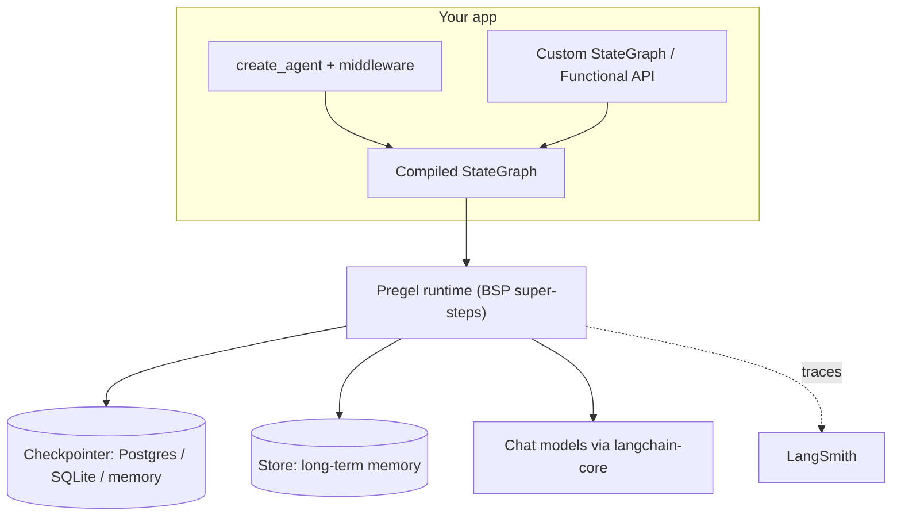

# LangChain & LangGraph

> [!abstract] TL;DR
> **LangChain** = provider-agnostic building blocks (chat models, messages, tools, retrievers) plus `create_agent`, a production agent loop with **middleware** hooks. **LangGraph** = the low-level runtime underneath: a stateful graph executor with checkpointing, `interrupt()` human-in-the-loop, streaming and durable execution. Both hit 1.0 in Oct 2025 with a no-breaking-changes-until-2.0 promise. Use `create_agent` first; drop to a raw `StateGraph` only when you need custom control flow.

## Introduction
- Started by Harrison Chase in Oct 2022 as a Python library of "chains". It is now maintained by **LangChain Inc.**, which earns money from **LangSmith** (tracing, evals, deployment). The OSS libraries are MIT-licensed, in Python and JS/TS (`langchain`, `@langchain/langgraph`).
- **LangGraph** came out in Jan 2024 because linear chains and the old `AgentExecutor` couldn't express loops, branches, persistence or human approval. It runs on its own: it doesn't need LangChain, only `langchain-core` for message types.
- In 1.0 (2025-10-22), LangChain was rebuilt **on top of** LangGraph. `create_agent` compiles to a LangGraph graph. Legacy chains, `AgentExecutor` and the old retrievers/indexing moved to `langchain-classic`.
- Where it sits: an app framework between the raw provider SDKs ([[LLM APIs & SDKs]]) and your product. Peers are [[AI Agents]] SDKs (OpenAI Agents SDK, Claude Agent SDK, Pydantic AI). [[n8n]]'s AI Agent nodes are built on LangChain.js.

## Core Concepts

### Package map (Python)
| Package | Contains |
|---|---|
| `langchain-core` | Base abstractions: `BaseChatModel`, messages, `Runnable`, tools, prompts, output parsers |
| `langchain` | `create_agent`, middleware, `init_chat_model`, structured output strategies |
| `langchain-openai`, `langchain-anthropic`, … | Provider integrations (versioned independently) |
| `langchain-community` | Long-tail community integrations, looser quality bar |
| `langchain-classic` | Pre-1.0 chains, `AgentExecutor`, legacy retrievers. Migration target only |
| `langgraph` | `StateGraph`, `Command`, `Send`, `interrupt`, Functional API |
| `langgraph-checkpoint-*` | Persistence backends: memory, sqlite, postgres |
| `deepagents` | Opinionated "deep agent" harness: planning, virtual FS, subagents |

### Chat models & messages
- `init_chat_model("anthropic:claude-sonnet-4-5")` gives you a provider-agnostic model. You can switch providers with a string change.
- Message types: `SystemMessage`, `HumanMessage`, `AIMessage` (`.tool_calls`), `ToolMessage` (`tool_call_id`).
- `.content_blocks` (new in 1.0) is a **standard content block** view across providers: text, reasoning, tool_call, image, citations. Use it instead of parsing provider-specific `.content`.
- Every model, prompt, retriever and graph is a **Runnable**: `invoke / ainvoke / stream / astream / batch`, plus `astream_events` for fine-grained events.

### Tools
```python
from langchain.tools import tool

@tool
def get_order(order_id: str) -> dict:
    """Fetch an order by ID. Use when the user mentions an order number."""
    return db.orders.get(order_id)
```
- The docstring and type hints become the JSON schema sent to the model. Write docstrings like you're [[Prompt Engineering|prompting]], because you are.
- `ToolRuntime` injection gives a tool access to state, context, the store and the stream writer without exposing them to the model.

### `create_agent` (LangChain 1.x)
```python
from langchain.agents import create_agent
from langchain.agents.middleware import SummarizationMiddleware, HumanInTheLoopMiddleware

agent = create_agent(
    model="openai:gpt-5",
    tools=[get_order, refund_order],
    system_prompt="You are a support agent for an e-commerce store.",
    middleware=[
        SummarizationMiddleware(model="openai:gpt-5-mini", trigger=("tokens", 4000)),
        HumanInTheLoopMiddleware(interrupt_on={"refund_order": True}),
    ],
    response_format=TicketSummary,          # Pydantic model → structured output
    checkpointer=checkpointer,              # required for HITL / multi-turn memory
)
agent.invoke({"messages": [{"role": "user", "content": "Refund #A123"}]},
             config={"configurable": {"thread_id": "user-42"}})
```
- Replaces `langgraph.prebuilt.create_react_agent`, which is deprecated in LangGraph 1.0.
- **Middleware hooks**: `before_agent`, `before_model`, `wrap_model_call`, `wrap_tool_call`, `after_model`, `after_agent`. Built-ins include summarization, HITL, PII redaction, model fallback, call limits, tool retry, LLM tool selector and todo list.
- `response_format`: `ToolStrategy` (works with any tool-calling model) or `ProviderStrategy` (native JSON schema). Since 1.1 it's inferred from **model profiles**.

### LangGraph primitives
| Primitive | What it is |
|---|---|
| **State** | `TypedDict`/Pydantic schema. Each key can have a **reducer** (`Annotated[list, add_messages]`) that defines how updates merge |
| **Node** | Function `state -> partial state update` |
| **Edge** | Fixed `add_edge(a, b)` or `add_conditional_edges(a, router_fn)` |
| `START` / `END` | Virtual entry and exit nodes |
| **Command** | A node's return value that updates state **and** routes: `Command(goto="x", update={...})` |
| **Send** | Dynamic fan-out (map-reduce): `[Send("worker", {"doc": d}) for d in docs]` |
| **interrupt()** | Pauses the graph, persists the pause, and resumes with `Command(resume=value)` |
| **Checkpointer** | Saves a state snapshot per super-step, keyed by `thread_id`. Gives short-term memory, time travel and fault tolerance |
| **Store** | Cross-thread long-term memory (namespaced key-value with optional vector search) |

```python
from typing import Annotated, TypedDict
from langgraph.graph import StateGraph, START, END
from langgraph.graph.message import add_messages

class State(TypedDict):
    messages: Annotated[list, add_messages]
    route: str

def classify(state: State) -> dict:
    return {"route": "billing" if "invoice" in state["messages"][-1].content else "general"}

g = StateGraph(State)
g.add_node("classify", classify)
g.add_node("billing", billing_agent)
g.add_node("general", general_agent)
g.add_edge(START, "classify")
g.add_conditional_edges("classify", lambda s: s["route"], ["billing", "general"])
g.add_edge("billing", END); g.add_edge("general", END)
app = g.compile(checkpointer=checkpointer)
```

### Streaming modes
`stream_mode=` accepts `"values"` (full state after each step), `"updates"` (deltas per node), `"messages"` (LLM tokens + metadata), `"custom"` (`get_stream_writer()` events) and `"debug"`. You can pass a list to combine them.

## Architecture / How It Works



- **Pregel / BSP execution**: each **super-step** runs every node triggered in the previous step, in parallel. Updates are applied through the channel reducers, then a checkpoint is written. Parallel branches that write the same key without a reducer raise `InvalidUpdateError`.
- **Durability**: `durability="exit" | "async" | "sync"` controls when checkpoints are flushed. `sync` is the safest and slowest option. On a crash you resume from the last checkpoint with the same `thread_id`. Pending writes from successful sibling nodes are kept, so finished work isn't redone.
- **Interrupt semantics**: when the graph resumes, the interrupted node **re-runs from its start**. Any side effect before `interrupt()` runs again, so keep it idempotent.
- **Recursion limit**: `config={"recursion_limit": N}` caps super-steps (default 25). Hitting it raises `GraphRecursionError`, which is your guard against infinite agent loops.
- **`create_agent` internals**: it builds a small graph (`model` ⇄ `tools`, with middleware nodes and wrappers spliced in). That's why everything LangGraph offers (checkpointing, streaming, interrupts) works on it.
- **Functional API**: `@entrypoint` + `@task` give you the same persistence and interrupts in plain imperative code with no explicit graph. Task results are cached in the checkpoint, so replays skip completed tasks.

## Project Structure
```text
my-agent/
├── pyproject.toml          # langchain, langgraph, langchain-<provider>, langgraph-checkpoint-postgres
├── langgraph.json          # Agent Server / Studio manifest
├── .env                    # provider keys, LANGSMITH_API_KEY, LANGSMITH_TRACING=true
└── src/agent/
    ├── graph.py            # builds & exports compiled graph (`graph = builder.compile()`)
    ├── state.py            # State TypedDict + reducers
    ├── tools.py
    ├── middleware.py
    └── prompts.py
```
```json
{
  "dependencies": ["."],
  "graphs": { "agent": "./src/agent/graph.py:graph" },
  "env": ".env",
  "python_version": "3.12"
}
```
- `langgraph dev` runs a local Agent Server with hot reload and Studio UI. `langgraph build` produces a Docker image you can self-host.
- Python ≥ 3.10 is required since 1.0.

## Use Cases
| Use case | Why it fits |
|---|---|
| Tool-calling support / ops agent | `create_agent` + HITL middleware for risky tools (refunds, deletes) |
| Long-running, multi-turn assistants | Checkpointer per `thread_id`, summarization middleware for context limits |
| Approval workflows | `interrupt()` survives restarts. Resume can happen hours later from another process |
| Agentic [[RAG]] | Graph routes between retrieve → grade → rewrite → answer, with loops |
| Multi-agent (supervisor, handoffs, swarm) | Subgraphs + `Command(goto=…, graph=Command.PARENT)` |
| Map-reduce over documents | `Send` fan-out, reducer fan-in |
| Provider-agnostic model layer | `init_chat_model` + model fallback middleware across OpenAI / Anthropic / Gemini |

## Pros & Cons
| Pros | Cons |
|---|---|
| Biggest ecosystem: 100s of model, vector store and tool integrations | Abstraction tax. Stack traces go through `Runnable` layers, and simple apps don't need it |
| LangGraph persistence, HITL and time-travel are production-grade and hard to rebuild | History of API churn (0.1 → 0.3 → 1.0). Old tutorials and LLM-generated code are often wrong |
| Middleware gives clean hooks for guardrails, PII and summarization | LangSmith is the "blessed" observability layer. Self-hosting it is enterprise-only |
| Python and JS/TS parity is good enough to share mental models | Integration quality varies a lot in `langchain-community` |
| 1.0 stability promise: no breaking changes until 2.0 | Real CVEs in serialization and checkpointers (see below) |
| Graph is explicit: easy to visualize, test and reason about | Checkpoint tables grow without bound. You must design retention |

## Alternatives & Peers
| Alternative | Strength vs LangChain & LangGraph | Weakness vs LangChain & LangGraph | Pick it when… |
|---|---|---|---|
| Raw provider SDK ([[LLM APIs & SDKs]]) | Zero abstraction, first access to new features | You build loops, retries, persistence and HITL yourself | Single provider, simple tool loop |
| OpenAI Agents SDK | Minimal API, handoffs, built-in tracing | Tilted toward OpenAI. Persistence and HITL are thinner | OpenAI-first product, small agent |
| Claude Agent SDK | The Claude Code harness: file system, bash, subagents, [[Model Context Protocol|MCP]] | Claude-only, coding/ops-agent shaped | Agents that act on files and shells |
| Pydantic AI | Type-safe, Pythonic, lightweight, durable execution via Temporal/DBOS | Smaller ecosystem | Typed Python services that value simplicity |
| LlamaIndex | Strongest ingestion/indexing for [[RAG]] | Weaker general agent orchestration | Document-heavy retrieval apps |
| CrewAI | Very fast role-based multi-agent prototyping | Less control over state and flow | Demos, role-play crews |
| Vercel AI SDK / Mastra | TS-native, first-class with [[Next.js]] streaming UI | Smaller graph/persistence story (Mastra is closing the gap) | TS-only web apps |
| [[n8n]] AI Agent node | Visual, no deploy work, 400+ app nodes | Limited state control, hard to test or version | Business automations, client workflows |

## Tips & Reminders
> [!tip] Start high, drop low
> Start with `create_agent` and add middleware. Write a custom `StateGraph` only when the control flow isn't "model ⇄ tools", for example deterministic routing, map-reduce or multi-agent supervision. Use a compiled `create_agent` as a **node** inside a bigger graph.

> [!tip] Always pass a `thread_id`
> Without a checkpointer and a `thread_id` you get no memory, no `interrupt()` and no resume. Use `InMemorySaver` in tests and Postgres in prod.

> [!tip] In ZP's stack
> - Persist with `langgraph-checkpoint-postgres` on [[Supabase]]/[[PostgreSQL]]. Use the **session pooler (5432) or a direct connection**. The transaction pooler (6543) breaks psycopg prepared statements; if you must use it, set `prepare_threshold=None`.
> - `PostgresSaver` needs `autocommit=True` and `row_factory=dict_row`, and `checkpointer.setup()` must run once (migrations).
> - Deploy with `langgraph build` → Docker image → [[Coolify]], behind [[Traefik]]. That avoids the LangSmith Deployment bill. The self-hosted Agent Server needs [[Redis]] + Postgres.
> - Front it from [[Next.js]] with `@langchain/langgraph-sdk` `useStream()` for token streaming and interrupt UI.

> [!tip] Testing
> Nodes are plain functions, so unit-test them directly. For graph tests, compile with `InMemorySaver` and a fake chat model (`GenericFakeChatModel`). Use `get_state` / `get_state_history(config)` to assert on paths.

> [!question] Self-check (exam prep)
> - What's the difference between a reducer key and a plain key when two parallel nodes write it?
> - Why does code before `interrupt()` run twice, and how do you make it safe?
> - `Command` vs conditional edges: when does each win?
> - Checkpointer vs Store: which one holds per-thread messages and which holds cross-thread user facts?
> - What 4 things moved to `langchain-classic` in 1.0, and what replaces `create_react_agent`?

## Versions & Breaking Changes
| Version | Released | Key changes | Breaking / migration notes |
|---|---|---|---|
| langchain 0.1 | 2024-01 | First "stable". Split into `langchain-core` / `-community` / partner packages | Import paths moved to partner packages |
| langgraph 0.1 | 2024-01 → 06 | `StateGraph`, checkpointers, HITL breakpoints | — |
| langchain 0.2 | 2024-05 | `langchain` no longer depends on `-community`. LangGraph recommended for agents | `AgentExecutor` soft-deprecated |
| langgraph 0.2 | 2024-08 | Checkpointers split into `langgraph-checkpoint-*` packages | New checkpoint schema, re-run `setup()` |
| langchain 0.3 | 2024-09 | Pydantic 2 internally | Pydantic v1 shims removed, Python 3.8 dropped |
| langgraph 0.3 | 2025-02 | Prebuilt agents split to `langgraph-prebuilt`. `interrupt()` + `Command` are mainstream | Static breakpoints are no longer the recommended HITL path |
| **langchain 1.0 / langgraph 1.0** | 2025-10-22 | `create_agent`, middleware, standard `content_blocks`, structured output strategies | Python ≥ 3.10. Legacy → `langchain-classic`. `create_react_agent` deprecated. No breaking changes until 2.0 |
| langchain 1.1 | 2025-Q4 | Model profiles. Smarter summarization middleware. `ProviderStrategy` inferred | — |
| langgraph-checkpoint 3.0 | 2025–26 | Hardened msgpack deserialization | Required to fix CVE-2026-28277 |
| langchain-core 1.6.2 | 2026-09 | Async OpenAI tools, content-mutation fixes | — |
| **langchain 1.4.2** | 2026-09-18 | Current stable (fixes) | — |
| **langgraph 1.2.12** | 2026-09-21 | Current stable | — |

> [!warning] Unverified — check before relying on this
> Exact release months for 0.x LangGraph and the 1.2 → 1.4 intermediate changelogs weren't verified in this run. Check GitHub releases.

## Critical Issues & Gotchas
> [!danger] CVE-2025-68664 "LangGrinch" — serialization injection (CVSS 9.3)
> `dumps()` / `dumpd()` in `langchain-core` didn't escape user-controlled dicts containing the reserved `lc` key. On `load()`, a prompt-injected payload could instantiate trusted classes and **pull secrets from env vars**. Fixed in `langchain-core` ≥ 0.3.81 (0.3 line). Upgrade to **≥ 1.2.22** to also cover CVE-2026-34070. Never `load()` serialized data that untrusted input touched.

> [!danger] LangGraph checkpointer RCE chain (CVE-2025-67644 + CVE-2026-28277)
> A SQL injection in the **SQLite** checkpointer chained with unsafe **msgpack deserialization** of checkpoint blobs gives RCE. Patched in `langgraph-checkpoint` ≥ 3.0 and `langgraph-checkpoint-sqlite` ≥ 3.0.1. Treat the checkpoint DB as code-executable: never let untrusted parties write to it, and don't expose metadata-filter params to user input.

> [!danger] CVE-2026-34070 — path traversal in legacy `load_prompt` (CVSS 7.5)
> Arbitrary file read through prompt-file paths. Fixed in `langchain-core` ≥ 1.2.22. Don't load prompts from user-supplied paths.

> [!danger] History of "LLM output → exec" chains
> CVE-2023-29374 (`LLMMathChain`) and CVE-2023-36258 (`PALChain`) ran model output as Python. Those classes now live in `langchain-experimental`/`classic`. Any tool that `eval`s, runs shell or runs SQL from model output is prompt-injection RCE. Sandbox it.

> [!warning] Operational footguns
> - **Unbounded checkpoint growth**: every super-step writes a checkpoint, and nothing prunes by default. Schedule cleanup per `thread_id` or use the TTL config on the Agent Server.
> - **Side effects before `interrupt()`** re-run on resume, which can double-charge, double-email or double-insert.
> - **Parallel writes without a reducer** raise `InvalidUpdateError`. Add `Annotated[..., operator.add]`.
> - **`GraphRecursionError`** at 25 steps on a looping agent is usually a prompt or tool-description bug, not a reason to raise the limit.
> - **Stale training data**: LLM copilots still emit `AgentExecutor`, `initialize_agent` and `LLMChain`. Check imports against the 1.x docs.
> - **Vendor gravity**: tracing defaults to LangSmith (US/EU SaaS). Under PDPA, sending customer PII in traces is a cross-border transfer. Redact with PII middleware, or self-host [[AI Evals & Observability|Langfuse]] via OTel.

## Deep Dives
- [[LangChain & LangGraph - Graph API, State & Control Flow]]
- [[LangChain & LangGraph - Agents, Tools & Middleware]]
- [[LangChain & LangGraph - Persistence, Memory & Human-in-the-Loop]]
- [[LangChain & LangGraph - Multi-Agent Systems & LangSmith]]

## Related
- [[AI Agents]] — agent loop concepts this framework implements
- [[RAG]] — retrievers and agentic RAG graphs
- [[Model Context Protocol]] — `langchain-mcp-adapters` loads MCP servers as tools
- [[LLM Fundamentals]] — tokens and context limits drive summarization middleware
- [[PostgreSQL]] / [[Supabase]] — checkpointer and store backend
- [[Redis]] — Agent Server task queue, caching
- [[n8n]] — LangChain.js under its AI Agent nodes
- [[Python]] / [[TypeScript]] — the two supported runtimes

## References
- Docs (Python): https://docs.langchain.com/oss/python/langchain/overview
- What's new in LangChain v1: https://docs.langchain.com/oss/python/releases/langchain-v1
- LangGraph v1 migration: https://docs.langchain.com/oss/python/migrate/langgraph-v1
- Release policy: https://docs.langchain.com/oss/python/release-policy
- LangGraph releases: https://github.com/langchain-ai/langgraph/releases
- 1.0 announcement: https://www.langchain.com/blog/langchain-langgraph-1dot0
- LangChain 1.1 changelog: https://changelog.langchain.com/announcements/langchain-1-1
- CVE-2025-68664 write-up: https://cyata.ai/blog/langgrinch-langchain-core-cve-2025-68664/
- Checkpointer SQLi → RCE: https://research.checkpoint.com/2026/from-sqli-to-rce-exploiting-langgraphs-checkpointer/
- CSA research note (2026-03): https://labs.cloudsecurityalliance.org/research/csa-research-note-langchain-langgraph-vulnerabilities-202603/
