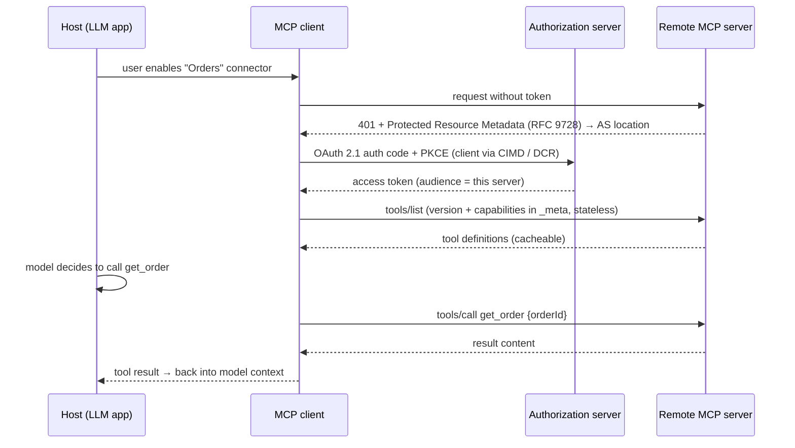

# Model Context Protocol

> [!abstract] TL;DR
> MCP is an open protocol (JSON-RPC 2.0) that standardises how AI applications connect to **tools, data (resources) and prompt templates**: "USB-C for AI integrations". Build a server once, and every MCP-capable client (Claude, ChatGPT, Cursor, VS Code, n8n, LangChain…) can use it. The **2026-07-28 spec** made the core **stateless**: no initialize handshake or sessions, per-request version and capabilities. Remote servers use Streamable HTTP + **OAuth 2.1**. MCP is now a major supply-chain and prompt-injection surface, so vet servers like dependencies.

## Introduction
- Anthropic open-sourced it in **Nov 2024**. OpenAI, Google, Microsoft and most IDE/agent vendors adopted it in 2025. It was **donated to the Linux Foundation's Agentic AI Foundation (AAIF) in Dec 2025** for neutral governance.
- It solves the M×N integration problem: M AI apps × N tools each needed custom glue. MCP makes it M + N.
- Spec revisions are dated: `2024-11-05` → `2025-03-26` → `2025-06-18` → `2025-11-25` → **`2026-07-28`** (current). There are official Tier-1 SDKs (TypeScript, Python, plus others) and a public MCP Registry.
- Where it sits: the tool/data layer for [[AI Agents]]. The host app (Claude Desktop, IDE, your agent) embeds MCP **clients** that talk to MCP **servers** (local process or remote HTTP service).

## Core Concepts

### Roles
| Role | Example |
|---|---|
| **Host** | Claude Desktop/Code, ChatGPT, Cursor, VS Code, your LangGraph app |
| **Client** | Connector inside the host, one per server connection |
| **Server** | Exposes capabilities: GitHub, Postgres, Supabase, Notion, your internal CRM |

### Server primitives
| Primitive | Controlled by | Purpose |
|---|---|---|
| **Tools** | Model | Actions/functions with JSON Schema input (and optional output schema) |
| **Resources** | Application | Readable data addressed by URI (files, rows, docs). Cacheable lists in 2026-07-28 |
| **Prompts** | User | Reusable prompt templates (often surfaced as slash commands) |

### Client features
- **Elicitation**: the server asks the user for structured input or confirmation, including URL-mode elicitation for out-of-band flows (2025-11-25).
- **Sampling** (server asks the client's LLM to generate), **Roots** and **Logging**: **deprecated in 2026-07-28** but supported for ≥ 12 months.
- **Tasks**: long-running operations. Moved to the `io.modelcontextprotocol/tasks` extension with polling (`tasks/get`, `tasks/update`) in 2026-07-28.

### Transports
- **stdio**: local server as a subprocess. It runs with the user's OS permissions.
- **Streamable HTTP**: a single HTTP endpoint with optional SSE streaming, for remote servers. The legacy HTTP+SSE transport is deprecated (1-year offramp from 2026-07).

### Minimal server (TypeScript SDK)
```ts
import { McpServer } from "@modelcontextprotocol/sdk/server/mcp.js";
import { z } from "zod";

const server = new McpServer({ name: "orders", version: "1.0.0" });

server.registerTool(
  "get_order",
  {
    description: "Fetch an order by ID for the authenticated tenant. Use before answering order-status questions.",
    inputSchema: { orderId: z.string().regex(/^A\d{3,}$/) },
  },
  async ({ orderId }, ctx) => {
    const tenant = await tenantFromAuth(ctx);          // from OAuth token, never from args
    const order = await db.orders.find(tenant, orderId);
    return { content: [{ type: "text", text: JSON.stringify(order) }] };
  },
);
```

> [!warning] Unverified — check before relying on this
> SDK method names changed across versions (`tool()` → `registerTool()`), and the 2026-07-28 stateless core brought updated Tier-1 SDKs. Check the current SDK README before copying.

## Architecture / How It Works



- **2026-07-28 stateless core**: the `initialize` / `notifications/initialized` handshake and protocol-level sessions are removed. Every request carries its protocol version and client capabilities in `_meta`. Header-based routing and cacheable list results let servers scale horizontally behind ordinary load balancers.
- **Multi Round-Trip Requests**: a server can ask follow-up questions (elicitation) within one logical request, without a sticky session.
- **Authorization**:
  - Remote servers act as OAuth 2.1 **resource servers** and advertise their authorization server via RFC 9728.
  - Clients register via **Client ID Metadata Documents** (CIMD, 2025-11-25) or Dynamic Client Registration.
  - Tokens must be audience-bound to the server (no token passthrough).
  - See [[OAuth 2.0 & OIDC]].
- **Extensions framework** (2026-07-28): optional capabilities (tasks, UI, etc.) are namespaced extensions instead of growing the core.

## Project Structure
```text
mcp-orders/
├── src/
│   ├── server.ts          # tool/resource/prompt registration
│   ├── auth.ts            # token validation (aud, scopes) → tenant context
│   ├── tools/             # one file per tool; zod schemas; authz inside
│   └── http.ts            # Streamable HTTP endpoint (behind Traefik/Cloudflare)
├── test/                  # MCP Inspector scripts + contract tests
├── Dockerfile
└── server.json            # MCP Registry metadata
```

## Use Cases
| Use case | Why it fits |
|---|---|
| Expose a client's internal system (CRM, ERP, orders) to Claude/ChatGPT | One server works across every MCP host the client's staff use |
| Coding agents with DB/infra context (Postgres, Supabase, GitHub, Sentry) | Official/vendor servers exist. Read-only modes |
| Agent frameworks (LangGraph, OpenAI Agents SDK, n8n) | Load MCP tools instead of writing adapters |
| Productizing an API for AI usage | A remote MCP server is a distribution channel into AI assistants |
| Internal knowledge tools | Resources + search tools over docs |

## Pros & Cons
| Pros | Cons |
|---|---|
| Write once, works in many AI hosts | Large, fast-moving spec. Breaking changes between revisions (2026-07 stateless) |
| Standard auth story (OAuth 2.1 + RFC 9728) | Security model relies on server trust + user consent UX |
| Neutral governance (Linux Foundation AAIF) | Tool definitions consume context tokens (many servers = bloated prompts) |
| Rich ecosystem + registry | Quality of community servers varies wildly. Many are abandoned or insecure |
| Stateless core scales like normal HTTP APIs (2026) | Local stdio servers run with full user permissions |

## Alternatives & Peers
| Alternative | Strength vs Model Context Protocol | Weakness vs Model Context Protocol | Pick it when… |
|---|---|---|---|
| Native function calling (per-provider tools) | Simplest, no extra process, full control | Re-implement per app/provider | Tools used only inside your own app |
| OpenAPI + tool generation | Reuses existing API specs | No standard discovery/auth/consent across hosts | Internal apps with good OpenAPI specs |
| A2A (Agent2Agent) | Agent-to-agent delegation, task lifecycle | Not for simple tool access | Cross-organization agent collaboration |
| Framework-specific tools (LangChain tools) | Tight integration | Locked to the framework | Single-framework projects |
| Plain REST + webhooks | Universal, mature tooling | AI hosts can't discover/use it automatically | Non-AI integrations |

## Tips & Reminders
> [!tip] Building servers
> - Design tools for the **model**: few, high-level, task-shaped tools (`find_customer_orders`) beat thin CRUD wrappers (`select_table`).
> - Return concise, structured results (use output schemas). Paginate, never dump 5 MB.
> - **Read-only by default**. Expose write tools separately, mark destructive ones clearly, and rely on host confirmation (elicitation) for side effects.
> - Validate the OAuth token audience and scopes on every call. Derive tenant/user from the token.
> - Test with **MCP Inspector**, then in at least two hosts (Claude + one IDE/ChatGPT).

> [!tip] Using servers
> - Treat MCP servers like npm dependencies: pin versions, review source, prefer official/vendor servers.
> - Run local servers with least privilege (containers, scoped tokens, read-only DB roles).
> - Disable servers you don't need per task. Every tool description costs context and widens the injection surface.

> [!tip] In ZP's stack
> - Productize client integrations as **remote MCP servers** (Docker on [[Coolify]] behind [[Traefik]]/[[Cloudflare]]). Clients' staff then use them from Claude/ChatGPT, and you can offer it as a retainer service.
> - [[Supabase]]/[[PostgreSQL]] MCP: connect with a **read-only role** (or a project-scoped, read-only mode). Never use the service-role key.
> - [[n8n]] can act as an MCP client (MCP Client Tool) and server (MCP Server Trigger), which is handy for exposing existing workflows as tools.

## Versions & Breaking Changes
| Version | Released | Key changes | Breaking / migration notes |
|---|---|---|---|
| 2024-11-05 | 2024-11 | Initial spec: tools, resources, prompts, sampling, stdio + HTTP+SSE | — |
| 2025-03-26 | 2025-03 | Streamable HTTP transport, OAuth 2.1 authorization, tool annotations | HTTP+SSE superseded |
| 2025-06-18 | 2025-06 | Structured tool output, elicitation, resource links, servers as OAuth resource servers (RFC 9728) | JSON-RPC batching removed. `MCP-Protocol-Version` header required |
| 2025-11-25 | 2025-11 | Experimental tasks, URL elicitation, Client ID Metadata Documents, sampling with tools | Auth discovery changes for clients |
| — | 2025-12 | Donated to Linux Foundation Agentic AI Foundation | Governance only |
| **2026-07-28** | 2026-07-28 | **Stateless core** (no initialize handshake/sessions), Multi Round-Trip Requests, header routing, cacheable lists, auth hardening, extensions framework, tasks → extension | Roots, Sampling, Logging deprecated (≥ 12 months support). Legacy HTTP+SSE deprecated (1-year offramp). Update SDKs |

## Critical Issues & Gotchas
> [!danger] CVE-2025-6514 — mcp-remote RCE (CVSS 9.6)
> `mcp-remote` (0.0.5–0.1.15, 437k+ downloads) passed a malicious server's authorization URL to the OS shell, giving **RCE on the client machine** when connecting to an untrusted remote server. Also **CVE-2025-49596**: unauthenticated RCE in Anthropic's MCP Inspector dev tool (fixed 0.14.1). Update dev tooling, and never connect to unknown remote servers from machines with secrets.

> [!danger] Tool poisoning, rug pulls and malicious servers
> - Hidden instructions in tool descriptions (incl. invisible Unicode tag characters) steer the model into exfiltrating files or secrets.
> - "Rug pulls": a server silently changes its tool definitions after approval.
> - **postmark-mcp (Sep 2025)**: a malicious npm MCP server that BCC'd every email to the attacker.
> - Scans in late 2025 found critical issues in roughly a third of public servers.
>
> **Mitigation**: pin and review servers, prefer vendor-official ones, run them in containers with least-privilege credentials, and watch for tool-definition changes.

> [!danger] Prompt injection through MCP data
> Data returned by tools (GitHub issues, emails, tickets) can carry instructions. The **GitHub MCP exploit (2025)** used a public issue to make an agent leak private repo contents. **Asana's MCP server (Jun 2025)** exposed data across tenants. Apply the lethal-trifecta rule from [[AI Agents]] and scope tokens per repo/project.

> [!warning] Footguns
> - **Token passthrough**: forwarding the client's token to downstream APIs breaks audience binding and is explicitly forbidden by the spec. Use token exchange.
> - Too many connected servers → hundreds of tool definitions → context bloat and worse tool selection. Use tool search or toggle servers.
> - stdio servers inherit your shell environment (cloud creds, SSH agent). Sandbox them.
> - Upgrading to the 2026-07-28 spec: code relying on `initialize`, sessions, sampling or roots needs refactoring.

## Deep Dives
N/A — no deep dives planned yet. Candidates: building a production remote server (auth + deployment), MCP security review checklist.

## Related
- [[AI Agents]] — MCP is the standard tool layer
- [[OAuth 2.0 & OIDC]] — authorization model for remote servers
- [[LangChain & LangGraph]] — `langchain-mcp-adapters`
- [[LLM APIs & SDKs]] — provider-side MCP connectors
- [[n8n]] — MCP client/server nodes
- [[Docker]] · [[Coolify]] — hosting remote servers

## References
- Spec (2026-07-28) changelog: https://modelcontextprotocol.io/specification/2026-07-28/changelog
- 2026-07-28 release post: https://blog.modelcontextprotocol.io/posts/2026-07-28/
- MCP roadmap: https://blog.modelcontextprotocol.io/posts/mcp-roadmap/
- The Register on the stateless shift: https://www.theregister.com/devops/2026/07/23/model-context-protocol-prepares-to-break-with-its-stateful-past/5276722
- Vulnerable MCP database: https://vulnerablemcp.info/
- MCP security statistics 2026: https://www.practical-devsecops.com/mcp-security-statistics-2026-report/
