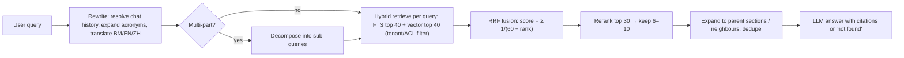

# RAG - Chunking & Retrieval Strategies

> [!info] Deep dive of [[RAG]]

> [!abstract] TL;DR
> RAG quality is decided before the LLM sees anything: **how documents are split** (chunking), **what each chunk carries** (context headers, metadata, ACLs) and **how candidates are found and ordered** (hybrid lexical + vector search, fusion, reranking, query rewriting). The 2026 default is: structure-aware chunks of ~300–800 tokens with contextual headers → hybrid BM25/FTS + vector search with mandatory tenant filters → RRF fusion → cross-encoder rerank → top 5–10 chunks with citations. Remember: **measure retrieval recall separately from answer quality**, or you'll tune the wrong stage.

## Concept

### Chunking strategies
| Strategy | How | Good for | Weakness |
|---|---|---|---|
| Fixed-size (tokens) + overlap | e.g. 512 tokens, 64 overlap | Uniform text, quick baseline | Splits sentences, tables, sections |
| Recursive / separator-based | Split on `\n\n` → `\n` → sentence → word until under size | General documents | Ignores semantic structure |
| **Structure-aware** | Split on headings, list items, table rows, code blocks. Keep the heading path | Policies, manuals, Markdown/HTML, contracts | Needs good parsing |
| Semantic | Break where embedding similarity between sentences drops | Long unstructured prose | Costly, non-deterministic boundaries |
| Parent–child (small-to-big) | Index small chunks, return the parent section | Precise matching + enough context | More storage, two-level logic |
| Document-level / late chunking | Embed the whole doc (long-context embedders) then pool spans | Short docs, long-context embedding models | Model support varies |
| Q&A / proposition extraction | LLM converts text into atomic facts or FAQ pairs | FAQs, knowledge bases | LLM cost, possible distortion |

### Retrieval methods
| Method | Strength | Weakness |
|---|---|---|
| Dense vectors (cosine / inner product) | Paraphrase and semantic match, multilingual | Exact codes, names, numbers, rare terms |
| Sparse lexical (BM25 / Postgres FTS) | Exact terms, SKUs, error strings, legal references | Synonyms, cross-language |
| Learned sparse (SPLADE-style) | Lexical + expansion | Extra model/infra |
| **Hybrid + RRF** | Best of both, robust baseline | Two indexes |
| **Cross-encoder reranking** | Scores the (query, chunk) pair jointly, big precision gain | Latency (~50–300 ms for 20–50 candidates), cost |
| Metadata filtering | Tenant, ACL, date, doc type | Over-filtering hides relevant docs |

## How It Works



- **Contextual retrieval**: before indexing, an LLM writes 1–2 sentences that situate each chunk in its document ("This section of Kedai X's 2026 refund policy covers electronics returns…"), prepended to the chunk for both embedding and BM25. It's cheap with batch APIs + prompt caching of the whole document.
- **RRF** fuses ranked lists without score normalization, which is why it's the standard way to combine BM25 and vector results.
- **Rerankers** read the query and chunk together (cross-attention). Bi-encoder embeddings can't do this, which is why reranking catches near-misses.
- **Query rewriting** turns conversational follow-ups ("what about for Sabah?") into standalone queries using the chat history.

## Practical Usage

### Structure-aware chunker (sketch)
```ts
type Chunk = { id: string; docId: string; headingPath: string[]; text: string; tokens: number };

function chunkMarkdown(docId: string, md: string, maxTokens = 600, overlap = 60): Chunk[] {
  const sections = splitByHeadings(md);                      // keeps ["Refunds", "Electronics"] paths
  return sections.flatMap(s =>
    packParagraphs(s.paragraphs, maxTokens, overlap)         // never split tables/code blocks
      .map((text, i) => ({ id: `${docId}:${s.slug}:${i}`, docId, headingPath: s.path, text, tokens: countTokens(text) })));
}
// Embed:  `${doc.title} > ${headingPath.join(" > ")}\n${contextHeader}\n${text}`
```

### Schema for hybrid search in Postgres
```sql
CREATE TABLE chunks (
  id text PRIMARY KEY,
  tenant_id uuid NOT NULL,
  doc_id text NOT NULL,
  heading_path text[],
  content text NOT NULL,
  context_header text,
  tsv tsvector GENERATED ALWAYS AS (to_tsvector('simple', coalesce(context_header,'') || ' ' || content)) STORED,
  embedding vector(1536),
  acl text[] DEFAULT '{}',
  updated_at timestamptz DEFAULT now(),
  content_hash text NOT NULL
);
CREATE INDEX ON chunks USING gin (tsv);
CREATE INDEX ON chunks USING hnsw (embedding vector_cosine_ops);
CREATE INDEX ON chunks (tenant_id, doc_id);
ALTER TABLE chunks ENABLE ROW LEVEL SECURITY;   -- tenant isolation at the DB layer
```

### Retrieval evaluation harness
```ts
// golden: [{ q: "Can I return a used phone?", expected: ["policy-2026:refunds-electronics:0"] }, …]
for (const g of golden) {
  const ids = (await retrieve(g.q, { tenantId, k: 10 })).map(c => c.id);
  recallAt5 += g.expected.some(e => ids.slice(0, 5).includes(e)) ? 1 : 0;
  mrr += 1 / ((ids.findIndex(id => g.expected.includes(id)) + 1) || Infinity);
}
console.log({ recallAt5: recallAt5 / golden.length, mrr: mrr / golden.length });
```
- Track **Recall@k, MRR, nDCG** for retrieval. Track faithfulness, answer relevance and citation correctness for generation.

### Tuning knobs, in order of impact
| Knob | Typical range | Effect |
|---|---|---|
| Parsing quality | — | Biggest lever. Tables/scans/headers |
| Chunk size | 300–800 tokens | Smaller = precise, less context. Larger = more context, noisier embeddings |
| Overlap | 0–20% | Reduces boundary misses, adds duplicates |
| Candidates per method | 20–50 | Recall before reranking |
| Final k to the LLM | 5–10 (≈ 3–8k tokens) | Precision vs context cost |
| HNSW `ef_search` | 40–200 | ANN recall vs latency |
| Embedding model | Multilingual vs English-only, dims | Language coverage, cost, storage |

## Patterns & Anti-patterns
| Pattern | When | Anti-pattern to avoid |
|---|---|---|
| Heading path + doc title in every chunk | Structured docs | Orphan chunks ("It must be returned within 7 days" with no subject) |
| Hybrid + RRF + rerank | Default production setup | Vector-only search for SKU/code-heavy corpora |
| Tenant/ACL filter in SQL/RLS | Multi-tenant | Filtering in the prompt or post-LLM |
| Content hash → re-embed only changed chunks | Frequent updates | Nightly full re-embed of everything |
| "Not found" path + citations | Customer-facing answers | Forcing an answer from weak context |
| Golden retrieval set from real queries | Before tuning | Tuning by eyeballing 3 demo questions |

## Performance & Trade-offs
- **Latency budget** (typical): rewrite 200–600 ms (LLM) + hybrid retrieve 20–80 ms + rerank 50–300 ms + generation 1–5 s. Skip the rewrite for single-turn queries. Cache embeddings of frequent queries.
- **Storage**: 1536-dim float32 ≈ 6 KB per chunk + HNSW overhead. 1M chunks ≈ 6–10 GB. `halfvec` or binary quantization cuts it 2–32× with some recall loss.
- **Contextual headers** add one-off LLM cost per chunk (batch it), which is usually worth it for large heterogeneous corpora.
- **Bigger k** isn't free: more tokens, more distraction (context rot). Rerank and trim.

## Tips & Reminders
> [!tip]
> - Inspect 20 random chunks before building anything. Most RAG failures are visible there.
> - Keep chunk IDs stable (doc + section + index) so evals and citations survive re-indexing.
> - Store `source_url`/page numbers for citations, and render them in the UI.
> - For Malay, the `simple` FTS config avoids English stemming errors. Consider a multilingual embedding model and test per language.
> - **In ZP's stack**: [[Supabase]] pgvector + FTS + RLS covers most SME knowledge bases. [[n8n]] handles ingestion (Drive trigger → parse → chunk → contextualize via batch → upsert). Query-time retrieval lives in code (Next.js route / edge function) with evals.

## Version Notes
| Milestone | When | Impact |
|---|---|---|
| Dense retrieval (DPR) + RAG paper | 2020 | Vector retrieval mainstream |
| HNSW in pgvector 0.5 | 2023-08 | Postgres viable for ANN at scale |
| Contextual retrieval (Anthropic) | 2024-09 | Chunk context headers + BM25 + rerank cut retrieval failures up to ~67% |
| pgvector 0.8 iterative scans | 2024-10 | Filtered ANN returns enough rows |
| Long-context embedders / late chunking | 2024–25 | Document-aware embeddings |
| Agentic retrieval | 2025–26 | Model issues multiple searches. Chunking still matters |

## Critical Issues & Gotchas
> [!danger] Wrong-tenant or wrong-permission retrieval
> Missing filters leak other customers' or departments' documents into answers, which is a PDPA breach and a trust killer. Enforce filters with RLS or mandatory query parameters, and test with cross-tenant probes in CI.

> [!warning] Gotchas
> - Changing the chunker or embedding model invalidates evals and indexes. Version both and re-index fully.
> - PDF parsing silently drops tables or reorders columns. Validate with samples (or use layout-aware parsers/OCR).
> - Duplicate near-identical chunks (versions of the same policy) crowd out results. Dedupe and prefer the latest version via metadata.
> - Query/document language mismatch (BM question, EN docs) kills BM25. Translate the query or rely on multilingual vectors.
> - Rerankers have max input lengths. Long chunks get truncated before scoring.

## Related
- [[RAG]]
- [[PostgreSQL - Indexing]] — GIN for FTS, HNSW for vectors
- [[Vector Databases]] — dedicated stores beyond Postgres scale
- [[LLM Fundamentals - Tokens, Context & Sampling]] — context budget
- [[AI Evals & Observability]] — retrieval and answer metrics

## References
- Anthropic, Contextual Retrieval: https://www.anthropic.com/news/contextual-retrieval
- RRF paper (Cormack et al., 2009): https://plg.uwaterloo.ca/~gvcormac/cormacksigir09-rrf.pdf
- pgvector (HNSW, iterative scans, halfvec): https://github.com/pgvector/pgvector
- Late chunking (Jina AI): https://arxiv.org/abs/2409.04701
- RAGAS metrics: https://docs.ragas.io/
